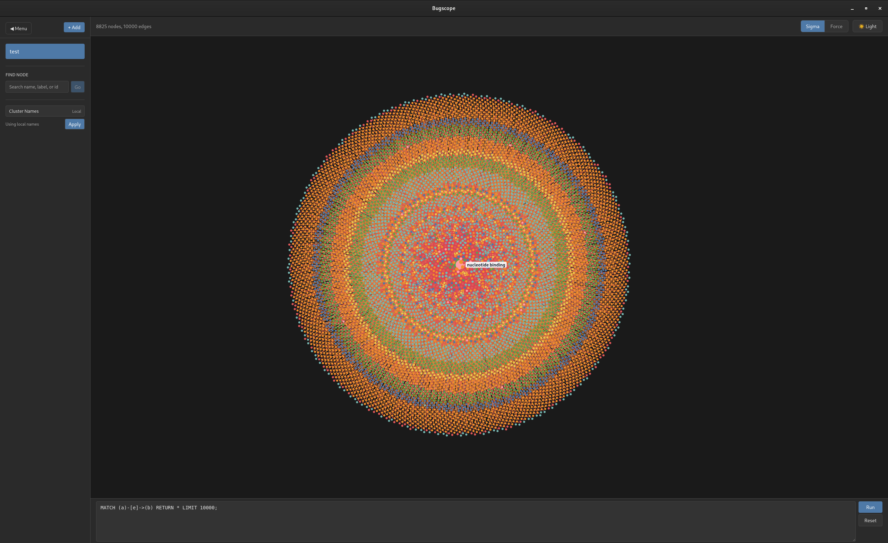

# Bugscope Graph Visualizer

<p align="center">
  
</p>

An interactive graph visualization tool for ladybugdb. Explore relationships between bugs, files, and other entities in your databases through an intuitive visual interface.

## Features

- **Interactive Graph View** - Navigate through connected data using a force-directed graph. Drag nodes to rearrange, zoom in/out, and pan around the canvas.
- **Database Selection** - Choose from available ladybugdb databases in the sidebar to visualize their relationships.
- **Visual Encoding** - Node size reflects connection count (more connections = larger nodes), and colors differentiate entity types.
- **Dark/Light Mode** - Toggle between dark and light themes for comfortable viewing.
- **Relationship Labels** - Hover over edges to see the type of relationship between connected nodes.
- **Optional LLM Cluster Names** - Provide an LLM access token to name Leiden clusters from a random sample of 15 node labels in each cluster.

## Getting Started

1. **Install dependencies**
   ```bash
   npm install
   ```

2. **Start the application**
   ```bash
   cargo tauri dev --features=icebug-analytics -- -- ../test.lbdb
   ```

The application opens as a Tauri desktop app. Pass a `.lbdb` path after `-- --` to load that database at startup.

## Usage

1. Select a database from the sidebar on the left
2. The graph will load and display nodes (entities) and edges (relationships)
3. Click and drag nodes to rearrange the layout
4. Scroll to zoom in/out, click and drag the canvas to pan
5. Hover over nodes to see their labels
6. Hover over edges to see relationship types
7. Use the theme toggle button to switch between dark and light modes

## Optional LLM Cluster Naming

Cluster naming is disabled by default. To enable it, expand the sidebar's Cluster Names section, enter an LLM access token, and click Apply. Cluster computation still starts with local fallback names; the backend only sends a random sample of 15 labels for clusters that are currently visible in the drill view, then falls back to `Cluster N` if a request fails.

The endpoint defaults to `https://openrouter.ai`, and the model field defaults to `deepseek-v4-flash`. Base endpoints are sent through their `/api/v1/chat/completions` path, and both fields can be changed in the sidebar before applying.

## Requirements

- Node.js
- A running ladybugdb backend API at `http://localhost:3001`
